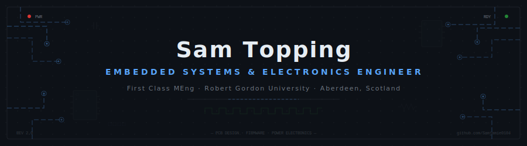
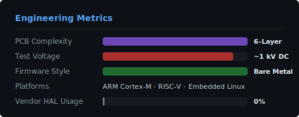

<div align="center">



<br>

<a href="https://www.sam-topping.co.uk">

</a>

<br><br>

[](https://www.sam-topping.co.uk)
&nbsp;&nbsp;
[](https://www.linkedin.com/in/sam-topping-768558229/)
&nbsp;&nbsp;
[](https://github.com/Samjamie0104)

</div>

<br>

---

```c
/* ════════════════════════════════════════════════════════════════════════
 *  SYSTEM INIT
 *  ──────────────────────────────────────────────────────────────────────
 *  Engineer    Sam Topping
 *  Education   MEng Electronic & Embedded Systems (First Class)
 *              Robert Gordon University · Aberdeen, Scotland
 *  Industry    Ashtead Technology — Subsea Instrumentation
 *  Domain      Hardware · Firmware · Power Electronics · PCB Design
 *  Focus       RTOS Development · HV PCB Design · Multimaster I2C
 * ════════════════════════════════════════════════════════════════════════ */

#define PHILOSOPHY "If the datasheet doesn't scare you, you haven't read it properly."
```

I design embedded systems from the PCB up — hardware, firmware, power electronics, and low-level software. My work spans bare-metal ARM and RISC-V development, high-voltage instrumentation, embedded communications, and production-oriented PCB design.

I specialise in systems that operate close to the hardware layer: register-level firmware, mixed-signal electronics, and robust embedded architectures designed for real-world deployment.

---

<div align="center">

## ⚡ Stack

<br>

**`Languages`**


**`Hardware & Silicon`**


**`Domains`**


</div>

<br>

---

<br>

<div align="center">

## 🔬 Featured Projects

</div>

<br>

<table>
<tr>
<td width="50%" valign="top">

### ⚡ [High Voltage Cable Tester](https://www.sam-topping.co.uk/portfolio/high-voltage-automated-cable-tester-project)

**16-channel automated subsea cable qualification system**

`~1kV DC` `6-layer PCB` `Galvanic Isolation` `Precision Sensing`

Programmable high-voltage insulation testing with sub-microamp leakage measurement. Distributed microcontroller architecture with isolated sensing domains. Built for harsh industrial and subsea environments.

> *The kind of project where one wrong trace means smoke.*

</td>
<td width="50%" valign="top">

### 💡 [WCH CH32V003 WS2812](https://github.com/Samjamie0104/WCHCH32V003_WS2812)

**Bare-metal WS2812B driver · RISC-V · No HAL**

`Register-Level` `Sub-μs Timing` `Direct GPIO` `Zero Abstraction`

WS2812B demands 400ns/850ns timing precision. Built through direct register manipulation on a RISC-V core — no vendor HAL, no libraries. Every clock cycle accounted for.

> *When your timing budget is nanoseconds, there's no room for abstractions.*

</td>
</tr>
<tr>
<td width="50%" valign="top">

### 🔐 [AES Encryption](https://github.com/Samjamie0104/AES_Encyryption)

**AES from first principles in C**

`Clean Room` `No Libraries` `CMake` `Modular Architecture`

Complete AES implementation without third-party crypto libraries. Every SubBytes, ShiftRows, and MixColumns operation written from scratch to understand encryption at the bit level.

> *Because "just use OpenSSL" doesn't teach you anything.*

</td>
<td width="50%" valign="top">

### 📡 [I2C Multimaster Sim](https://github.com/Samjamie0104/I2C_Multimaster_Simulations)

**Python simulation of I2C bus arbitration**

`Multimaster` `Arbitration Logic` `Bus Conflicts` `Protocol Analysis`

Full simulation of I2C multimaster arbitration — bus ownership, collision handling, and transaction-level timing. Validate embedded communication architectures before committing to silicon.

> *Simulate the bus fight before it happens on real hardware.*

</td>
</tr>
</table>

<details>
<summary><b>🔧 More Projects</b></summary>
<br>

### [Blackpill — STM32F411 Bare-Metal](https://github.com/Samjamie0104/blackpill)

Register-level STM32F411 development. Direct peripheral access — timers, DMA, GPIO — all through register manipulation. Understanding Cortex-M at the level the silicon intended.

`STM32F411` `DMA` `Timers` `Bare Metal`

</details>

<br>

---

<br>

<div align="center">

## 📊 Stats

<br>


&nbsp;


<br><br>


</div>

<br>

---

<div align="center">

<br>

### Embedded systems engineered from silicon to software.

*If it runs on bare metal and handles real voltage, I'm interested.*

<br>


</div>
